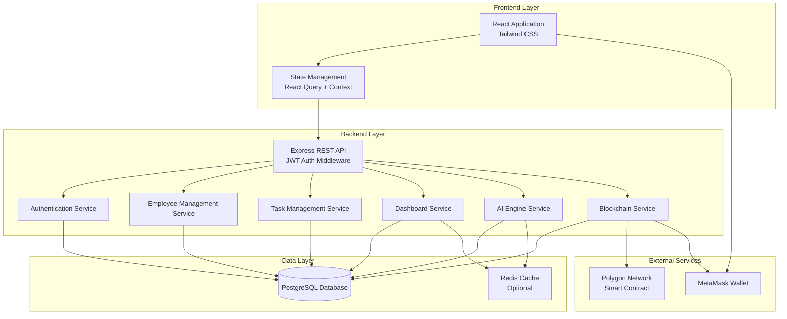

# Design Document: AI-HRMS Platform

## Overview

The AI-HRMS Platform is a full-stack workforce management system that combines traditional HRMS capabilities with AI-powered workforce intelligence and optional Web3 integration. The system follows a multi-tier architecture with clear separation between frontend (React), backend API (Node.js), database (PostgreSQL), AI engine, and blockchain integration layer.

### Technology Stack Selection

**Backend: Node.js with Express**
- Rationale: Excellent ecosystem for REST APIs, strong async support for AI/blockchain operations, faster development velocity, rich library support for JWT, database ORMs, and blockchain SDKs
- Alternative considered: Golang (better raw performance but slower development for this feature-rich platform)

**Database: PostgreSQL**
- Rationale: Strong relational model fits HRMS data (organizations → employees → tasks), ACID compliance for financial/payroll data, excellent JSON support for flexible skill storage, mature ecosystem
- Alternative considered: MongoDB (flexible schema but weaker consistency guarantees for critical workforce data)

**Blockchain: Polygon (Ethereum L2)**
- Rationale: Low gas costs for frequent workforce logging, Ethereum compatibility, mature tooling (ethers.js), wide wallet support (MetaMask), faster finality than Ethereum mainnet
- Alternatives: Solana (faster but less mature tooling), Ethereum (high gas costs)

**Wallet: MetaMask**
- Rationale: Most widely adopted, works with Polygon/Ethereum, browser extension + mobile support, excellent developer documentation

**Smart Contract Language: Solidity**
- Rationale: Industry standard for Ethereum/Polygon, extensive tooling (Hardhat, Truffle), large developer community, well-audited patterns

### Architecture Principles

1. **Multi-tenancy by design**: All data queries filtered by organization_id
2. **API-first**: Backend exposes RESTful APIs consumed by frontend
3. **Async AI/Blockchain**: Long-running operations execute asynchronously with job queues
4. **Fail-safe Web3**: Blockchain failures don't block core HRMS functionality
5. **Stateless backend**: JWT-based authentication enables horizontal scaling
6. **Separation of concerns**: Clear boundaries between auth, business logic, AI, and blockchain layers

## Architecture

### System Architecture Diagram



### Request Flow

**Standard API Request Flow:**
1. Frontend sends HTTP request with JWT token
2. API Gateway validates JWT and extracts organization_id
3. Request routed to appropriate service
4. Service applies organization_id filter to all queries
5. Database returns filtered results
6. Response formatted and returned to frontend

**AI-Enhanced Request Flow:**
1. Standard flow up to service layer
2. Service checks cache for recent AI results
3. If cache miss, AI Engine performs calculations
4. Results cached with TTL and returned
5. Async job updates AI models if needed

**Blockchain Logging Flow:**
1. Task completion triggers workforce event
2. Event queued in database with "pending" status
3. Async worker picks up event
4. Blockchain service submits transaction
5. Transaction hash stored, status updated to "confirmed"
6. Retry logic handles failures

## Components and Interfaces

### Frontend Components

#### 1. Authentication Module
- **LoginPage**: Organization login form with email/password
- **RegisterPage**: Organization registration with validation
- **AuthContext**: React context providing auth state and methods
- **ProtectedRoute**: Route wrapper requiring authentication

#### 2. Dashboard Module
- **DashboardPage**: Main landing page with metrics cards
- **MetricsCard**: Reusable component for displaying single metric
- **ProductivityChart**: Visualization of productivity trends
- **useDashboardData**: Custom hook fetching dashboard metrics

#### 3. Employee Management Module
- **EmployeeListPage**: Table view of all employees with search/filter
- **EmployeeFormModal**: Form for adding/editing employees
- **EmployeeDetailPage**: Detailed view of single employee with tasks and scores
- **WalletConnectButton**: Button triggering MetaMask connection
- **useEmployees**: Custom hook for employee CRUD operations

#### 4. Task Management Module
- **TaskListPage**: Table view of all tasks with filters
- **TaskFormModal**: Form for creating/editing tasks
- **TaskStatusBadge**: Visual indicator of task status
- **TaskAssignmentRecommendations**: AI-powered employee suggestions
- **useTasks**: Custom hook for task CRUD operations

#### 5. AI Insights Module
- **ProductivityScorePage**: Employee productivity scores with rankings
- **SkillGapAnalysisPage**: Skill gap visualization and recommendations
- **PerformanceTrendsPage**: Performance trend predictions with charts
- **useAIInsights**: Custom hook for AI feature data

#### 6. Web3 Module
- **BlockchainActivityPage**: List of on-chain logged events
- **TransactionDetailModal**: Detailed view of blockchain transaction
- **useWallet**: Custom hook for wallet connection state
- **useBlockchainLogger**: Custom hook for on-chain logging operations

### Backend Services

#### 1. Authentication Service

**Interface:**
```typescript
interface AuthService {
  register(orgData: OrganizationRegistration): Promise<Organization>
  login(credentials: LoginCredentials): Promise<AuthToken>
  verifyToken(token: string): Promise<TokenPayload>
  refreshToken(refreshToken: string): Promise<AuthToken>
}

interface OrganizationRegistration {
  name: string
  email: string
  password: string
  industry?: string
}

interface LoginCredentials {
  email: string
  password: string
}

interface AuthToken {
  accessToken: string
  refreshToken: string
  expiresIn: number
}

interface TokenPayload {
  organizationId: string
  email: string
  role: string
}
```

**Responsibilities:**
- Hash passwords using bcrypt (10 rounds)
- Generate JWT tokens with 1-hour expiration
- Validate credentials against database
- Implement refresh token rotation

#### 2. Employee Management Service

**Interface:**
```typescript
interface EmployeeService {
  createEmployee(orgId: string, data: EmployeeData): Promise<Employee>
  updateEmployee(orgId: string, empId: string, data: Partial<EmployeeData>): Promise<Employee>
  deleteEmployee(orgId: string, empId: string): Promise<void>
  getEmployee(orgId: string, empId: string): Promise<Employee>
  listEmployees(orgId: string, filters?: EmployeeFilters): Promise<Employee[]>
  connectWallet(orgId: string, empId: string, walletAddress: string): Promise<Employee>
}

interface EmployeeData {
  name: string
  email: string
  role: string
  department: string
  skills: string[]
  walletAddress?: string
}

interface Employee extends EmployeeData {
  id: string
  organizationId: string
  createdAt: Date
  updatedAt: Date
}

interface EmployeeFilters {
  department?: string
  role?: string
  skills?: string[]
}
```

**Responsibilities:**
- Validate employee data against schemas
- Enforce organization_id isolation
- Validate wallet addresses for blockchain format
- Handle cascading updates when employees are deleted

#### 3. Task Management Service

**Interface:**
```typescript
interface TaskService {
  createTask(orgId: string, data: TaskData): Promise<Task>
  updateTaskStatus(orgId: string, taskId: string, status: TaskStatus): Promise<Task>
  updateTask(orgId: string, taskId: string, data: Partial<TaskData>): Promise<Task>
  deleteTask(orgId: string, taskId: string): Promise<void>
  getTask(orgId: string, taskId: string): Promise<Task>
  listTasks(orgId: string, filters?: TaskFilters): Promise<Task[]>
}

interface TaskData {
  title: string
  description: string
  assignedTo: string // employee ID
  complexity: 'low' | 'medium' | 'high'
  dueDate?: Date
}

interface Task extends TaskData {
  id: string
  organizationId: string
  status: TaskStatus
  createdAt: Date
  updatedAt: Date
  completedAt?: Date
}

type TaskStatus = 'assigned' | 'in_progress' | 'completed'

interface TaskFilters {
  assignedTo?: string
  status?: TaskStatus
  department?: string
}
```

**Responsibilities:**
- Enforce valid status transitions
- Trigger productivity recalculation on completion
- Trigger blockchain logging on completion (if wallet connected)
- Validate task assignments against existing employees

#### 4. Dashboard Service

**Interface:**
```typescript
interface DashboardService {
  getMetrics(orgId: string): Promise<DashboardMetrics>
  getProductivityTrends(orgId: string, period: TimePeriod): Promise<TrendData[]>
}

interface DashboardMetrics {
  totalEmployees: number
  activeEmployees: number
  assignedTasks: number
  completedTasks: number
  productivityIndicators: {
    averageCompletionRate: number
    averageProductivityScore: number
    tasksCompletedThisWeek: number
    tasksCompletedThisMonth: number
  }
}

interface TrendData {
  date: Date
  value: number
  metric: string
}

type TimePeriod = '7d' | '30d' | '90d'
```

**Responsibilities:**
- Aggregate metrics efficiently using database queries
- Calculate active employees (activity within last 7 days)
- Cache metrics with 5-minute TTL
- Compute productivity indicators from task and score data

#### 5. AI Engine Service

**Interface:**
```typescript
interface AIEngineService {
  calculateProductivityScore(orgId: string, empId: string): Promise<ProductivityScore>
  detectSkillGaps(orgId: string, empId: string): Promise<SkillGap[]>
  recommendTaskAssignment(orgId: string, taskRequirements: TaskRequirements): Promise<EmployeeRecommendation[]>
  predictPerformanceTrend(orgId: string, empId: string): Promise<PerformanceTrend>
  batchCalculateScores(orgId: string): Promise<void>
}

interface ProductivityScore {
  employeeId: string
  score: number // 0-100
  calculatedAt: Date
  factors: {
    completionRate: number
    averageCompletionTime: number
    taskComplexityHandled: number
  }
}

interface SkillGap {
  skill: string
  priority: 'critical' | 'high' | 'medium' | 'low'
  reason: string
}

interface TaskRequirements {
  requiredSkills: string[]
  complexity: 'low' | 'medium' | 'high'
  department?: string
}

interface EmployeeRecommendation {
  employeeId: string
  employeeName: string
  suitabilityScore: number // 0-100
  reasoning: {
    skillsMatch: number
    workloadScore: number
    productivityScore: number
    availabilityScore: number
  }
}

interface PerformanceTrend {
  employeeId: string
  trend: 'improving' | 'stable' | 'declining' | 'insufficient_data'
  confidence: number // 0-1
  contributingFactors: string[]
  predictedScore: number
}
```

**Responsibilities:**
- Implement productivity scoring algorithm
- Maintain skill taxonomy and role requirements mapping
- Calculate weighted task assignment recommendations
- Perform trend analysis on historical productivity data
- Cache AI results with 1-hour TTL

**AI Algorithm Details:**

**Productivity Score Calculation:**
```
completionRate = completedTasks / totalAssignedTasks
avgCompletionTime = average(actualTime / estimatedTime) for completed tasks
complexityBonus = weighted average based on task complexity (low: 1x, medium: 1.5x, high: 2x)

productivityScore = (
  completionRate * 40 +
  (1 / avgCompletionTime) * 30 +
  complexityBonus * 30
) normalized to 0-100 scale
```

**Task Assignment Recommendation:**
```
For each employee:
  skillsMatch = (matching skills / required skills) * 100
  workloadScore = (1 - currentTasks / maxCapacity) * 100
  productivityScore = employee's current productivity score
  availabilityScore = 100 if not at capacity, else 0
  
  suitabilityScore = (
    skillsMatch * 0.40 +
    workloadScore * 0.30 +
    productivityScore * 0.20 +
    availabilityScore * 0.10
  )

Sort by suitabilityScore descending
```

**Performance Trend Prediction:**
```
Require minimum 4 data points (weekly scores over 30 days)
Apply linear regression: y = mx + b
If slope m > 0.05: trend = 'improving'
If slope m < -0.05: trend = 'declining'
Else: trend = 'stable'
Confidence = R² value from regression
```

#### 6. Blockchain Service

**Interface:**
```typescript
interface BlockchainService {
  connectWallet(address: string): Promise<WalletConnection>
  logWorkforceEvent(event: WorkforceEvent): Promise<TransactionResult>
  verifyTransaction(txHash: string): Promise<TransactionDetails>
  getEmployeeHistory(walletAddress: string): Promise<WorkforceEvent[]>
  getOrganizationHistory(orgId: string): Promise<WorkforceEvent[]>
}

interface WalletConnection {
  address: string
  network: string
  connected: boolean
}

interface WorkforceEvent {
  eventType: 'task_completion' | 'payroll_proof' | 'activity_hash'
  employeeWallet: string
  organizationId: string
  taskId?: string
  timestamp: Date
  dataHash: string
}

interface TransactionResult {
  txHash: string
  status: 'pending' | 'confirmed' | 'failed'
  blockNumber?: number
  gasUsed?: number
}

interface TransactionDetails {
  txHash: string
  blockNumber: number
  timestamp: Date
  event: WorkforceEvent
  status: 'confirmed' | 'failed'
}
```

**Responsibilities:**
- Manage Web3 provider connection to Polygon
- Queue workforce events for batch submission
- Submit transactions to smart contract
- Handle transaction failures with retry logic (max 3 attempts)
- Store transaction hashes for verification
- Implement gas price estimation and limits

### API Layer Architecture

**Middleware Stack:**
1. CORS middleware (configured origins)
2. Body parser (JSON, limit: 10MB)
3. Request logging middleware
4. JWT authentication middleware
5. Organization context injection middleware
6. Rate limiting middleware
7. Error handling middleware

**Authentication Middleware:**
```typescript
interface AuthMiddleware {
  verifyJWT(req, res, next): void
  extractOrganization(req, res, next): void
  requireAdmin(req, res, next): void
}
```

Extracts JWT from Authorization header, verifies signature, injects `req.organizationId` and `req.role` for downstream services.

## Data Models

### Database Schema

#### Organizations Table
```sql
CREATE TABLE organizations (
  id UUID PRIMARY KEY DEFAULT gen_random_uuid(),
  name VARCHAR(255) NOT NULL,
  email VARCHAR(255) UNIQUE NOT NULL,
  password_hash VARCHAR(255) NOT NULL,
  industry VARCHAR(100),
  subscription_tier VARCHAR(50) DEFAULT 'free',
  blockchain_wallet VARCHAR(255),
  created_at TIMESTAMP DEFAULT NOW(),
  updated_at TIMESTAMP DEFAULT NOW()
);

CREATE INDEX idx_organizations_email ON organizations(email);
```

#### Employees Table
```sql
CREATE TABLE employees (
  id UUID PRIMARY KEY DEFAULT gen_random_uuid(),
  organization_id UUID NOT NULL REFERENCES organizations(id) ON DELETE CASCADE,
  name VARCHAR(255) NOT NULL,
  email VARCHAR(255) NOT NULL,
  role VARCHAR(100) NOT NULL,
  department VARCHAR(100) NOT NULL,
  skills JSONB DEFAULT '[]',
  wallet_address VARCHAR(255),
  is_active BOOLEAN DEFAULT true,
  last_activity_at TIMESTAMP,
  created_at TIMESTAMP DEFAULT NOW(),
  updated_at TIMESTAMP DEFAULT NOW(),
  UNIQUE(organization_id, email)
);

CREATE INDEX idx_employees_org ON employees(organization_id);
CREATE INDEX idx_employees_wallet ON employees(wallet_address);
CREATE INDEX idx_employees_department ON employees(organization_id, department);
```

#### Tasks Table
```sql
CREATE TABLE tasks (
  id UUID PRIMARY KEY DEFAULT gen_random_uuid(),
  organization_id UUID NOT NULL REFERENCES organizations(id) ON DELETE CASCADE,
  title VARCHAR(255) NOT NULL,
  description TEXT,
  assigned_to UUID NOT NULL REFERENCES employees(id) ON DELETE CASCADE,
  status VARCHAR(50) NOT NULL DEFAULT 'assigned',
  complexity VARCHAR(50) NOT NULL,
  due_date TIMESTAMP,
  created_at TIMESTAMP DEFAULT NOW(),
  updated_at TIMESTAMP DEFAULT NOW(),
  completed_at TIMESTAMP,
  CHECK (status IN ('assigned', 'in_progress', 'completed'))
);

CREATE INDEX idx_tasks_org ON tasks(organization_id);
CREATE INDEX idx_tasks_employee ON tasks(assigned_to);
CREATE INDEX idx_tasks_status ON tasks(organization_id, status);
```

#### Productivity Scores Table
```sql
CREATE TABLE productivity_scores (
  id UUID PRIMARY KEY DEFAULT gen_random_uuid(),
  organization_id UUID NOT NULL REFERENCES organizations(id) ON DELETE CASCADE,
  employee_id UUID NOT NULL REFERENCES employees(id) ON DELETE CASCADE,
  score DECIMAL(5,2) NOT NULL CHECK (score >= 0 AND score <= 100),
  completion_rate DECIMAL(5,2),
  avg_completion_time DECIMAL(10,2),
  complexity_bonus DECIMAL(5,2),
  calculated_at TIMESTAMP DEFAULT NOW(),
  UNIQUE(employee_id, calculated_at)
);

CREATE INDEX idx_productivity_employee ON productivity_scores(employee_id, calculated_at DESC);
CREATE INDEX idx_productivity_org ON productivity_scores(organization_id);
```

#### Blockchain Transactions Table
```sql
CREATE TABLE blockchain_transactions (
  id UUID PRIMARY KEY DEFAULT gen_random_uuid(),
  organization_id UUID NOT NULL REFERENCES organizations(id) ON DELETE CASCADE,
  employee_id UUID REFERENCES employees(id) ON DELETE SET NULL,
  event_type VARCHAR(50) NOT NULL,
  task_id UUID REFERENCES tasks(id) ON DELETE SET NULL,
  data_hash VARCHAR(255) NOT NULL,
  tx_hash VARCHAR(255),
  status VARCHAR(50) NOT NULL DEFAULT 'pending',
  block_number BIGINT,
  gas_used BIGINT,
  retry_count INT DEFAULT 0,
  created_at TIMESTAMP DEFAULT NOW(),
  confirmed_at TIMESTAMP,
  CHECK (status IN ('pending', 'confirmed', 'failed'))
);

CREATE INDEX idx_blockchain_org ON blockchain_transactions(organization_id);
CREATE INDEX idx_blockchain_status ON blockchain_transactions(status);
CREATE INDEX idx_blockchain_employee ON blockchain_transactions(employee_id);
```

#### Skill Taxonomy Table
```sql
CREATE TABLE skill_taxonomy (
  id UUID PRIMARY KEY DEFAULT gen_random_uuid(),
  skill_name VARCHAR(100) UNIQUE NOT NULL,
  category VARCHAR(100) NOT NULL,
  description TEXT
);

CREATE INDEX idx_skills_category ON skill_taxonomy(category);
```

#### Role Requirements Table
```sql
CREATE TABLE role_requirements (
  id UUID PRIMARY KEY DEFAULT gen_random_uuid(),
  role_name VARCHAR(100) NOT NULL,
  required_skills JSONB NOT NULL,
  priority_skills JSONB DEFAULT '[]',
  UNIQUE(role_name)
);
```

### Smart Contract Design

**Solidity Contract: WorkforceLogger.sol**

```solidity
// SPDX-License-Identifier: MIT
pragma solidity ^0.8.0;

contract WorkforceLogger {
    struct WorkforceEvent {
        address employeeWallet;
        bytes32 organizationId;
        bytes32 taskId;
        string eventType;
        bytes32 dataHash;
        uint256 timestamp;
    }
    
    mapping(address => WorkforceEvent[]) public employeeEvents;
    mapping(bytes32 => WorkforceEvent[]) public organizationEvents;
    mapping(address => bool) public authorizedOrganizations;
    
    address public owner;
    
    event EventLogged(
        address indexed employeeWallet,
        bytes32 indexed organizationId,
        bytes32 taskId,
        string eventType,
        uint256 timestamp
    );
    
    modifier onlyOwner() {
        require(msg.sender == owner, "Only owner can call");
        _;
    }
    
    modifier onlyAuthorized() {
        require(authorizedOrganizations[msg.sender], "Not authorized");
        _;
    }
    
    constructor() {
        owner = msg.sender;
    }
    
    function authorizeOrganization(address org) external onlyOwner {
        authorizedOrganizations[org] = true;
    }
    
    function logEvent(
        address employeeWallet,
        bytes32 organizationId,
        bytes32 taskId,
        string memory eventType,
        bytes32 dataHash
    ) external onlyAuthorized {
        WorkforceEvent memory newEvent = WorkforceEvent({
            employeeWallet: employeeWallet,
            organizationId: organizationId,
            taskId: taskId,
            eventType: eventType,
            dataHash: dataHash,
            timestamp: block.timestamp
        });
        
        employeeEvents[employeeWallet].push(newEvent);
        organizationEvents[organizationId].push(newEvent);
        
        emit EventLogged(employeeWallet, organizationId, taskId, eventType, block.timestamp);
    }
    
    function getEmployeeEvents(address employeeWallet) external view returns (WorkforceEvent[] memory) {
        return employeeEvents[employeeWallet];
    }
    
    function getOrganizationEvents(bytes32 organizationId) external view returns (WorkforceEvent[] memory) {
        return organizationEvents[organizationId];
    }
}
```

**Contract Responsibilities:**
- Record workforce events immutably
- Emit events for off-chain indexing
- Enforce authorization (only registered organizations can log)
- Provide query functions for employee and organization history
- Optimize gas usage through efficient data structures

## Components and Interfaces (Continued)

### API Endpoints

#### Authentication Endpoints
- `POST /api/auth/register` - Register new organization
- `POST /api/auth/login` - Login and receive JWT
- `POST /api/auth/refresh` - Refresh access token
- `GET /api/auth/me` - Get current organization info

#### Employee Endpoints
- `POST /api/employees` - Create employee
- `GET /api/employees` - List all employees (with filters)
- `GET /api/employees/:id` - Get employee details
- `PUT /api/employees/:id` - Update employee
- `DELETE /api/employees/:id` - Delete employee
- `POST /api/employees/:id/wallet` - Connect wallet to employee

#### Task Endpoints
- `POST /api/tasks` - Create task
- `GET /api/tasks` - List all tasks (with filters)
- `GET /api/tasks/:id` - Get task details
- `PUT /api/tasks/:id` - Update task
- `PATCH /api/tasks/:id/status` - Update task status
- `DELETE /api/tasks/:id` - Delete task

#### Dashboard Endpoints
- `GET /api/dashboard/metrics` - Get dashboard metrics
- `GET /api/dashboard/trends` - Get productivity trends

#### AI Endpoints
- `GET /api/ai/productivity/:employeeId` - Get productivity score
- `GET /api/ai/skill-gaps/:employeeId` - Get skill gap analysis
- `POST /api/ai/recommend-assignment` - Get task assignment recommendations
- `GET /api/ai/performance-trend/:employeeId` - Get performance trend prediction
- `POST /api/ai/batch-calculate` - Trigger batch score calculation

#### Blockchain Endpoints
- `POST /api/blockchain/connect-wallet` - Verify wallet connection
- `GET /api/blockchain/events` - Get on-chain events for organization
- `GET /api/blockchain/verify/:txHash` - Verify transaction on-chain
- `GET /api/blockchain/employee-history/:walletAddress` - Get employee's on-chain history

#### Health Endpoint
- `GET /api/health` - System health check

### Frontend State Management

**React Query for Server State:**
- Cache API responses with stale-while-revalidate strategy
- Automatic refetching on window focus
- Optimistic updates for mutations
- Query invalidation on related mutations

**React Context for Client State:**
- AuthContext: Current user, token, login/logout methods
- WalletContext: Connected wallet, connection status, connect/disconnect methods
- NotificationContext: Toast notifications for user feedback

**Custom Hooks Pattern:**
```typescript
// Example: useEmployees hook
function useEmployees(filters?: EmployeeFilters) {
  return useQuery({
    queryKey: ['employees', filters],
    queryFn: () => api.employees.list(filters),
    staleTime: 5 * 60 * 1000 // 5 minutes
  })
}

function useCreateEmployee() {
  const queryClient = useQueryClient()
  return useMutation({
    mutationFn: (data: EmployeeData) => api.employees.create(data),
    onSuccess: () => {
      queryClient.invalidateQueries(['employees'])
      queryClient.invalidateQueries(['dashboard'])
    }
  })
}
```

## Correctness Properties

*A property is a characteristic or behavior that should hold true across all valid executions of a system—essentially, a formal statement about what the system should do. Properties serve as the bridge between human-readable specifications and machine-verifiable correctness guarantees.*

